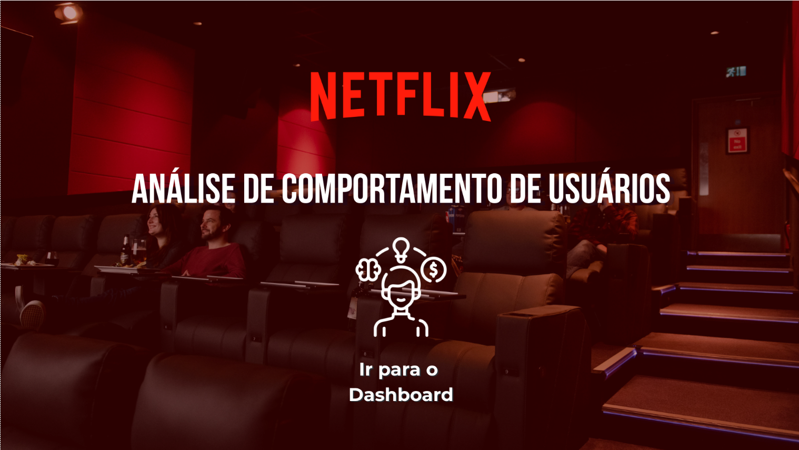
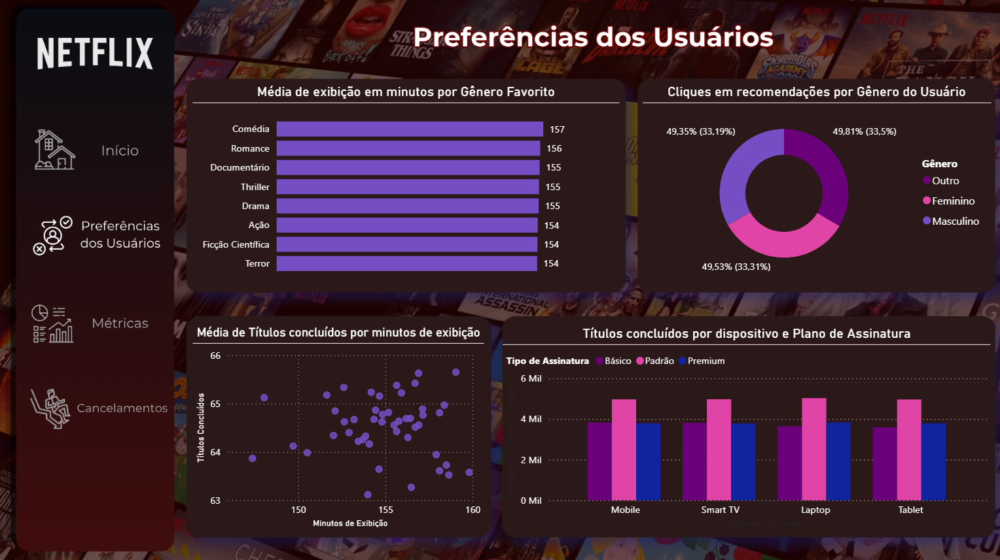
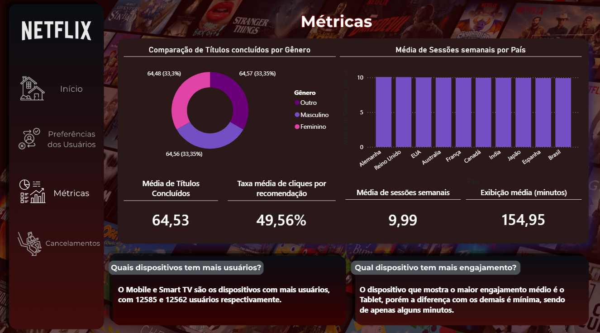
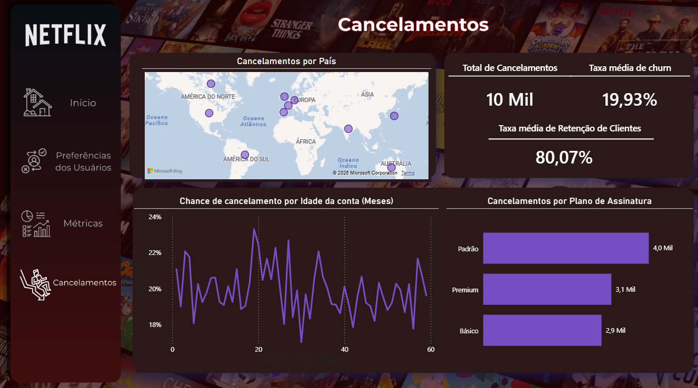

# 📊 Análise de Comportamento de Usuários da Netflix

Projeto desenvolvido com SQL Server e Power BI utilizando o Netflix User Behavior Dataset do Kaggle.

O objetivo foi responder perguntas de negócios, avaliar métricas da plataforma e sugerir melhorias para evitar o churn de clientes (cancelamento de assinatura)

---

## Tecnologias

- SQL Server
- Power BI
- DAX
- Excel (Arquivo CSV)
- Kaggle Dataset

---

## Objetivos

- Entender as preferências dos usuários 
- Estudar as métricas da plataforma e dados de cancelamento
- Criação de dashboard executivo
- Geração de insights para tomada de decisão

---

## Processo do Projeto

1. Importação da base
2. Respondendo 8 perguntas de negócio em SQL
3. Modelagem no Power BI
4. Criação de métricas
5. Desenvolvimento do dashboard
6. Extração de insights

---

## Dashboard

### Tela Inicial

### Preferências dos Usuários

### Métricas

### Cancelamentos

---

## Principais Insights

- Taxa de retenção de clientes está boa (80,07%), enquanto a de churn (Evasão de clientes) está por volta de 20%
- A maioria dos dados analisados estão muito homogêneos, mesmo com diferentes tipos de filtros
- Usuários que passam mais tempo assistindo tendem a concluir mais títulos
- O tipo de assinatura que mais está concluindo títulos é o Standard (Padrão), mas ao mesmo tempo o que mais está sofrendo cancelamentos
- As recomendações estão captando até 50% dos cliques dos usuários
- Usuários com 1 ano e meio de conta tendem a cancelar mais o plano

## Recomendações

- Criar campanhas e melhorias de produto antes do pico de cancelamento (18-19 meses) para reter mais usuários na plataforma
- Fazer testes A/B para recomendações captarem mais cliques (como trocar thumbnail, recomendar algo que gere curiosidade do usuário e títulos relacionados ao seu histórico de preferência).
- Criar um modelo que detecte sinais de um futuro cancelamento do usuário e intervir com uma abordagem mais personalizada para evitar isso

## Estrutura do Projeto

SQL/
    Comportamento de usuários da Netflix.sql
    View de Plano de Assinatura.sql
    Tabela de Meio de pagamento.sql
    Tabela de gênero dos usuários.sql
    Tabela de Faixa Etária.sql

Power BI/
    Netflix - Análise de comportamento de usuários.pbix

Imagens/
    README.md

## Dataset

Netflix User Behavior
(Kaggle)

## Desafios encontrados

- Identificação e tradução de valores da base de dados para o português
- Ordenação personalizada das categorias no Power BI.
- Desenvolvimento de métricas DAX para cálculos de estatística descritiva (média, soma, porcentagem).

## Autor

Tiago Bassoli

Analista de Dados em formação, com conhecimentos em SQL, Power BI, Python e tratamento de dados.

LinkedIn: www.linkedin.com/in/tiago-gabriel-bassoli
GitHub: https://github.com/TiagoBassoli