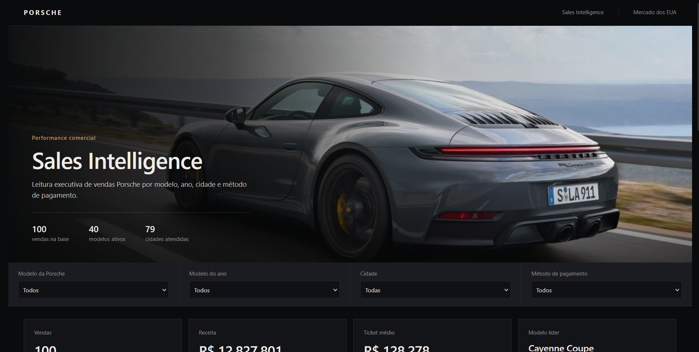
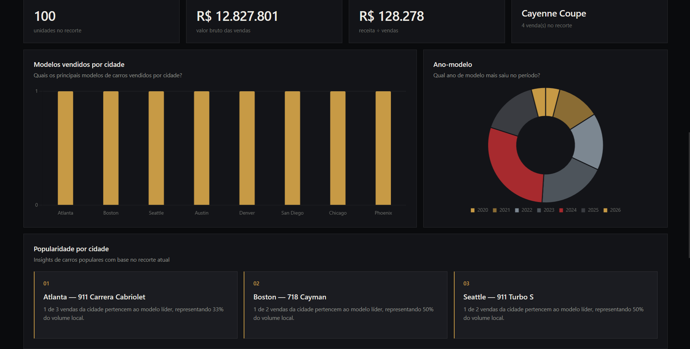
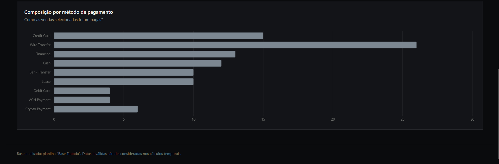

# 🚘 Dashboard da Porsche com Agentes de IA 🤖
Projeto desenvolvido com ChatGPT e Claude usando base de dados fictícia da Porsche
O objetivo foi demonstrar como agentes de IA podem contribuir para criação de Dashboards profissionais e úteis para tomada de decisão com base em dados já tratados.

---

## Tecnologias

- Excel 
- ChatGPT
- Claude

---

## Objetivos

- Limpeza e tratamento dos dados no Excel
- Construção de script para responder perguntas de negócios e avaliar métricas
- Criação de dashboard profissional com tema escuro e imagem de fundo

---

## Processo do Projeto

1. Importação da base
2. Tratamento dos dados
3. Avaliação de métricas e perguntas de negócios
4. Engenharia de prompt para criação visual do Dashboard em HTML no ChatGPT
5. Ajustes finais nos temas e inserindo a imagem de capa com Claude

---

## Dashboard

### Tela Inicial

### Métricas e Insights

### Gráfico Final

## Dataset

Disponibilizado no curso da plataforma DIO de Excel com IA e Claude da Santander

## Autor

Tiago Bassoli

Analista de Dados, com conhecimentos em Excel (Tabelas Dinâmicas, Gráficos, Power Query), SQL, Power BI, Python e tratamento de dados.

LinkedIn: www.linkedin.com/in/tiago-gabriel-bassoli
